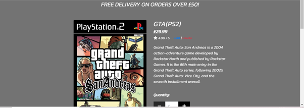
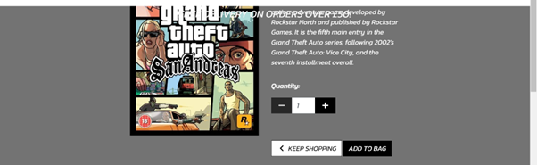

# Milestone project 5
# Console HQ

["Console HQ"](https://consolehq.herokuapp.com/) is an ecommerce website designed for people to buy a wide variety of consoles and games.

This website was targeted at people who want to easily purchase any game or console online. Users would be able to select from a wide range of merchandise from the catalogue avaliable on the products page. A search bar and navigation bar will be avaliable enabling users to filter through and locate a specific product. There will also be a shopping bag section, which would allow users to manage the products that they want to buy. A secure payment option would also be, allowing users to safely input their payment details. This will establish trust between the business and its customers. When customers feel confident that their payment information is protected, they are more likely to make purchases and share their sensitive data. The ability to add reviews would also be avaliable to users as this will allow them to share their feedback and experiences with the products they have purchased. By providing a platform for customers to express their opinions, the business can gather valuable insights and improve its offerings based on customer feedback. This interactive feature encourages customer engagement and loyalty, as users feel their voices are heard and valued by the business.

This website was built using knowledge gained from HTML, CSS, JavaScript, Python and Django modules, for the purpose of completing my fifth Milestone Project for the Code Institute's full stack developer course. This website is easy to navigate and easy to read, with a clear goal and aim.

 # User Experience/User Interface (UX/UI)

 - ## User Stories
   ### Developer Goals
   As the developer I want: 
   - to be able to add a console or game to the list. So that I can add new consoles or games to the store.
   - to be able to edit and update a console or game. So that I can change product prices, descriptions, images and other product criteria.
   - to be able to delete a console or game from the list. So that I can remove consoles or games that are no longer for sale.
   - to be able to add a discount on to any category of console or game on the list. So that I can encourage customers to purchase those items. 

   
   ### Shopper Goals
   As a shopper I want:
   - to view a list of consoles and games. So that I can select some to purchase.
   - to view individual console and game product details. So that I can identify price, description and product rating.
   - to be able to easily view the total of my purchases. So that I can avoid spending to much.
   - to be able to sort the list of available consoles and games. So that I can easily identify the best rated and priced console.
   - to be able to sort out a specific category of console. So that I can sort the consoles in a specific category by name.
   - to be able to search for a console or game by name or description. So that I can find a specific console or game to purchase.
   - to be able to easily see what I have searched for and a number of results. So that I can quickly decide whether the console I want is available.
   - to be able to easily select the quantity of consoles or games when purchasing them. So that I can ensure I do not accidently select the wrong quantity.
   - to be able to view the consoles or games selected to be purchased in a bag. So that I can identify the total cost of the purchase and all items to be received.
   - to be able to adjust the quantity of each individual console or game in my bag. So that I can easily make changes to my purchase.
   - to be able to quickly identify deals and special offers. So that I can take advantage on special savings.
   - to be able to sort through multiple categories of consoles simultaneously. So that I can find the best priced and rated products across the categories.
   - to be able to easily enter payment information. So that I can check out with no hassle.
   - to be able to feel like my personal and payment information is safe and secure. So that I can confidently provide the needed information to make a purchase.
   - to be able view an order confirmation after checkout. So that I can verify that I have not made any mistakes. 
   - to be able to receive an email confirmation after checking out. So that I can keep the confirmation of what I have purchased for my records.
   - to be able to sign up to the newsletter and receive my one-time coupon so that I can gain more knowledge on the website and take advantage on special savings.

   ### Frequent site users Goals
   As a frequent site user  I want:
   - to be able to easily register for an account. So that I can have a personal account and be able to view the profile.
   - to be able to easily log in or log out. So that I can access my personal account information.
   - to be able to easily recover my password in case it is forgotten. So that I can recover access to my account.
   - to be able to receive an email confirmation after registering. So that I can verify that my account registration was successful.
   - to be able to have a personalised user profile. So that I can view my personal order history, order confirmations and payment information.
   - to be able to sort between the categories of consoles and games. So that I can easily locate a game or a console depending on my needs.
   
 - ## Design 
   ### Data Model
   - The main entities in my data models include Order, OrderLineItem, Category, Product, Review, Deals, NewsletterSubscription, Coupon, and UserProfile.
    
   - The Order model represents an order placed by a user and includes details such as order number, user profile, contact information, shipping address, date, and order totals. Each order can have multiple line items, which are captured by the OrderLineItem model. It stores information about the ordered product, quantity, and line item total.

   - The Category model defines different categories for products and has fields for category name and a friendly name. The Product model represents individual products available in my e-commerce system. It includes fields such as product name, description, price, rating, image, and discounted price. Each product can belong to multiple categories through a many-to-many relationship.

   - The Review model allows users to post reviews for products. It includes fields for the associated product, review author, content, date, and an approval status. The Deals model captures special deals or discounts associated with specific categories. It stores the category and the discount percentage.

   - The NewsletterSubscription model represents users who have subscribed to a newsletter. It includes a reference to the associated user, a subscription status, and whether a coupon has been used. The Coupon model stores discount codes assigned to users. It contains the user reference, discount code, discount amount, and a flag indicating if the coupon has been used.

   - Lastly, the UserProfile model maintains user-specific information such as default delivery details. It is linked to the built-in User model through a one-to-one relationship and includes fields for phone number, street addresses, town/city, county, postcode, and country.

   ### Data Model Diagram 
   

   ### Wireframes
   
   
   

   ### Colour Scheme
   - White Text:
    Readability: White text on a dark or contrasting background is known for its high readability. It provides a sharp contrast, making it easier for users to read the content.
    Clean and Minimalistic: White is associated with cleanliness, simplicity, and minimalism. It can give your website a modern and sophisticated look, allowing the content to take center stage without distractions.

   - Gray Background:
    Neutral and Versatile: Gray is a neutral color that works well with various design elements and color combinations. It provides a subtle backdrop, allowing other colors and content to stand out.
    Balance and Calmness: Gray is often associated with stability, balance, and calmness. It can create a harmonious and soothing visual experience, particularly when combined with other colors.
    Enhances Focus: A light gray background can help reduce eye strain and improve focus. It provides a comfortable reading environment, especially for longer periods of browsing.
    
   - Black Text:
    Visual Hierarchy: Using black text selectively can help establish visual hierarchy and draw attention to important elements. Headings, subheadings, or call-to-action buttons can be highlighted effectively with black text.
    Contrast and Impact: Black text on a light background creates a strong contrast, making the text highly visible and legible. It ensures that essential information stands out and grabs users' attention.

  ## SEO 
   ### Keywords

 # Features
 - ## Responsive Website
   

   - This website changes it's layout to best display the content depending on the screen size. This allows the user to use the website on various different devices. 
 
 - ## NavBar 
   - ###  Logged Out User
   

    - This shows my navigation bar when a user is not logged in. A user is able to click on the website name which would redirect them back to the homepage. There is a search bar which would redirect users to a filtered view of the products depending on the specific requirements. There is a 'my account' button which allows you to log in or register for an account if you do not have one. Users are also able to click the shopping bag which would allow them to manage the contents in their bag. There are also further filters which allows the user to filter by specific categories such as manufactors or special deals. 

   - ### Logged In User
   

    - The main differnce is that when the 'my account' button is clicked, the user has the option to see their profile. However if the user is a super user thenn they also have the option to add products on the website. There is also the option of a logged in user to log out of their accoount.

  - ## HomePage 
   

    - This shows the homepage of the website. There is a button which labelled 'shop now' which redirects users to a view of all the products available. 

  - ## Products view page  
   
   

   - This shows all the products available to purchase. It displays the products name, description, image, rating and price/discounted price.
 
   

   - When a super user is logged in they have the option to edit and delete the products they have added on to the website. 

   - ### Discounted products 
   
   
   
   - Certain categories of products have a discount applied on to them. A super user can add and ammend these discounts in the admin panel. When a product has a discount applied they are displayed in the special deals category in the navbar. The products originsl price and discounted price are both on display. 

  - ## Products detail page
   
     

   - This shows the view of when an indivdual product is selected. Users are able to see details of the product like the name, description, price, and image. Users are also able to select the quantity they require of the product and add it to their basket. 

  - ## Review section 

   

   - This shows the reviews for the specific product selected. It shows the date when the review was created, the name of the user who created the review and the actual review itself.

   

   - When the user is logged in, a button whcih allows them to add a review is displayed. When clicked the button redirects users to the add review form. 

   

   - This form allows users to input their name and their review of the specific product. 

   

   - This allows users to save their reviews to the database. 

  - ## Shopping bag section 
   

   - This shows the user that their bag is empty and gives them the option to keep shopping. 

   
   

   - This shows the user details of what they have in their shopping bag. These details include the prodcuts name, sku, image and price. Users also have the ability to update the quantity of the item or remove the item from the shopping bag completely. The bag total and delivery total is also displayed on the page. Additionally the user has the choice of continuing to shop or advancing to the secure checkout. 

  - ## Checkout section
   
   
   

   - This shows the section where users can input their personal details to purchase a product. These details include the suers full name, address for delivery and payment information. If the user has a valid coupon they can also input it here for a 20% discount off the total price. There is also an order summary so users can be confident in exactly what they are purchasing. An adjust bag button is also avaliable incase users what to ammend their shopping bags, howveer if they do not they can just click the complete order button. 

  - ## Confirmation section
   
   

   - This shows the user a receipt of their order. The recipt shows details of the order, the address the order is being sent to, and the billing information. 

  - ## Product management section
   
   
   

   - A super user is able to add a new product on to the website through this form. 

  - ## Profile section
   
   

   - This shows the details of the logged in user and any transactions they have made previously. The order numbber, order name, order total, and date the order was placed is displayed on this page. 

  - ## Footer
   
   - This shows the footer elements. Users are able to click on the facebook link to be redirected to the websites facebook page, if they wanted to learn more about the website. Users are also able to sign up to a newsletter. When its a users fist time signing up to the newsletter, a coupon code is generated for them which when used gives the user a 20% discount. 

   - ### Coupon
   

   - To view the coupon generated users would need access to the admin panel. 

   - ### Facebook page 
   
   

   - This shows the Facebook page created for this website incase users want more information. 

  - ## UserInterface
   - ### Sign in Page
   
   - This shows the form used for a user to sign into their account 

   - ### Sign up Page
   
   - This shows the form used for a user to sign up for a new account 

   - ### Sign out Page
   
   - This shows the form used for a user to sign out of their accounts.

 # Possible Future Features
   -  
   - 
   -  
    
 # Testing 
 - ## Automated 
  - I have created some python files which automatically test my models.py, my forms.py, my views.py, my contexts.py and my utils.py in my different applications. 

 - ## Manual 
   - This website has been tested using three different browsers (Google Chrome, Firefox, Safari) and I can confirm that it works. 
   - This website has been tested with all the standard screen sizes and I can confirm that it is responsive. 

    ### Navigation Bar
    All Pages:
    TEST            | OUTCOME                          | PASS / FAIL  
    --------------- | -------------------------------- | ---------------
    Home page | When clicking on the title "Console HQ" button on the nav bar, the browser redirects to the home page. | PASS
    Search Bar | When a query is typed in and searched, the page will redirect to return anything the user searched for.  | PASS
    Loging/ Log Out Pages | When clicking on the log in or log out button the page redirects to the log in page or logs the user out | PASS
    Register Page | When clicking on the register button it redirects to the register page. | PASS
    Shopping Bag | When clicking on the shopping bag button it redirects to the shopping bag page. | PASS
    Filters | When clicking on any of the filter options it redirects to the relevant filtered page. | PASS
    Foreground and background | Checked foreground and background information is clearly legible | PASS
    Text | Checked the text is clearly legible against the background | PASS

    ### Home Page
    TEST            | OUTCOME                          | PASS / FAIL  
    --------------- | -------------------------------- | ---------------
    Responsiveness | Checked elements for consistant scaleability | PASS
    Accessibility | Checked the accessibility of the page using lighthouse | PASS

    ### View Products page 
    TEST            | OUTCOME                          | PASS / FAIL  
    --------------- | -------------------------------- | ---------------
     Media | All media assets are displayed properly, have no pixelation or stretched images and is responsive on all devices. | PASS
     Responsiveness | Check every element on-page for consistent scalability in mobile, tablet and desktop view.| PASS
     Accessibility | Checked the accessibility of the page using lighthouse| PASS
     Responsiveness | Checked elements for consistant scaleability | PASS.
    
    ### View Products Detail page 
    TEST            | OUTCOME                          | PASS / FAIL  
    --------------- | -------------------------------- | ---------------
     Media | All media assets are displayed properly, have no pixelation or stretched images and is responsive on all devices. | PASS
     Responsiveness | Check every element on-page for consistent scalability in mobile, tablet and desktop view.| PASS
     Accessibility | Checked the accessibility of the page using lighthouse| PASS
     Responsiveness | Checked elements for consistant scaleability | PASS.
     Add to bag | Checked the correct item and correct quantity is added to the bag | PASS
    

    ### View Shopping Bag page 
    TEST            | OUTCOME                          | PASS / FAIL  
    --------------- | -------------------------------- | ---------------
    Media | All media assets are displayed properly, have no pixelation or stretched images and is responsive on all devices. | PASS
    Responsiveness | Check every element on-page for consistent scalability in mobile, tablet and desktop view.| PASS
    Accessibility | Checked the accessibility of the page using lighthouse| PASS
    Responsiveness | Checked elements for consistant scaleability | PASS.
    Add to checkout | Checked the correct item and the correct price is added to the checkout | PASS

    ### View Checkout page 
    TEST            | OUTCOME                          | PASS / FAIL  
    --------------- | -------------------------------- | ---------------
    Media | All media assets are displayed properly, have no pixelation or stretched images and is responsive on all devices. | PASS
    Responsiveness | Check every element on-page for consistent scalability in mobile, tablet and desktop view.| PASS
    Accessibility | Checked the accessibility of the page using lighthouse| PASS
    Responsiveness | Checked elements for consistant scaleability | PASS.
    Checkout Form | Checked the form submits only when all required fields are filled out. | PASS

    ### Add Review page
    TEST            | OUTCOME                          | PASS / FAIL  
    --------------- | -------------------------------- | ---------------
    Responsiveness | Checked elements for consistant scaleability | PASS
    Save button | When clicking the Save button on the page, the form in inputted into the database and the browser redirects to the review page. | PASS
    Add Review Form | Checked the form submits only when all required fields are filled out. | PASS
    Accessibility | Checked the accessibility of the page using lighthouse| PASS

    ### Edit Products page
    TEST            | OUTCOME                          | PASS / FAIL  
    --------------- | -------------------------------- | ---------------
    Media | All media assets are displayed properly, have no pixelation or stretched images and is responsive on all devices. | PASS
    Responsiveness | Check every element on-page for consistent scalability in mobile, tablet and desktop view.| PASS
    Accessibility | Checked the accessibility of the page using lighthouse| PASS
    Edit Products Form | Checked the form submits only when all required fields are filled out. | PASS
    Logged in user | Checked the form can only be edited by the user who created the post. | PASS

    ### Delete Products page
    TEST            | OUTCOME                          | PASS / FAIL  
    --------------- | -------------------------------- | ---------------
    Responsiveness | Check every element on-page for consistent scalability in mobile, tablet and desktop view.| PASS
    Accessibility | Checked the accessibility of the page using lighthouse| PASS
    Delete Products Form | Checked the form is succesfully deleted | PASS
    Logged in user | Checked the form can only be deleted by the user who created the post. | PASS

    ### Register page
    TEST            | OUTCOME                          | PASS / FAIL  
    --------------- | -------------------------------- | ---------------
    Media | All media assets are displayed properly, have no pixelation or stretched images and is responsive on all devices. | PASS
    Responsiveness | Check every element on-page for consistent scalability in mobile, tablet and desktop view.| PASS
    Accessibility | Checked the accessibility of the page using lighthouse| PASS
    Register form | Checked the form submits only when all required fields are filled out. | PASS
    Sign in link | Checked the sign-in link redirects to the sign-in page. | PASS

    ### Sign in Page
    TEST            | OUTCOME                          | PASS / FAIL  
    --------------- | -------------------------------- | ---------------
    Media | All media assets are displayed properly, have no pixelation or stretched images and is responsive on all devices. | PASS
    Responsiveness | Check every element on-page for consistent scalability in mobile, tablet and desktop view.| PASS
    Accessibility | Checked the accessibility of the page using lighthouse| PASS
    Sign in form | Checked the form submits only when all required fields are filled out. | PASS
    Signup link | Checked the signup link redirects to the signup page. | PASS

 - ## Validator 
   - ### HTML
     - The official ["W3C validator"](https://validator.w3.org/) was used to validate my HTML. 
     
   - ### CSS 
     - The official ["W3C validator (Jigsaw)"](https://jigsaw.w3.org/css-validator/) was used to validate my CSS. 
     
   - ### Javascript
     - The Javascript file was validated using ["JSHint"](https://jshint.com/) and no errors were found. The New JavaScript features (ES6) option was ticked in the Configure menu.
   
   - ### Python
     - The Python Code was validated using a ["Pep8 python checker"](https://pep8ci.herokuapp.com/#) from code institute.
      
  - ## Accessibility 
    

    - The Lighthouse function in devtools was used to see if the font and the font colours used were easy to read and access. I can confirm that the page on my website passed. 
      
 # Languages used 
   - HTML
   - CSS
   - Javascript
   - Python

 # Technologies Used 
   - Git 
     - Allowed me to add commit and push my code to github for version control. 
   - Gitpod 
     - The programme used to code my website.
   - Github 
     - Allowed me to store my repository and files pushed from Gitpod.
   - Fontawesome 
     - Used to display icons to make my website more visually appealing. 
   - Chrome developer tools 
     - Allowed me to troubleshoot and edit my code.
   - Am I Responsive 
     - Allowed me to check the responsiveness of my website at different screen sizes. 
   - W3C Validator 
     - Allowed me to validate my HTML and CSS code against industry standard. 
   - JSHint 
     - Allowed me to validate my Javascript code against industry standard.

 # Deployment
  - This code was deployed using Code Institute's mock terminal for Heroku. 

  - ## Steps for deployment:
   1. In the top right corner of the page click on the fork button. 
   2. The next page will show a forked version of my project.
   3. Create a new Heroku app.
   4. Set the buildbacks to Python and NodeJS in that order.
   5. Link the Heroku app to the repository. 
   6. Click on deploy. 

 # Credits
 - ## Images
   - All of the images used were found on ["Wikipedia"](https://en.wikipedia.org/wiki/Main_Page)

 - ## Information 
   - All of the information used were found on ["Wikipedia"](https://en.wikipedia.org/wiki/Main_Page)

 - ## Code
   
   - 
    
 # Acknowledgement 
    - The online tutors that Code Institute provides. 
    - My mentor Ben Kav for helping me when I was stuck. 
    - Everybody on slack, for their advice. 